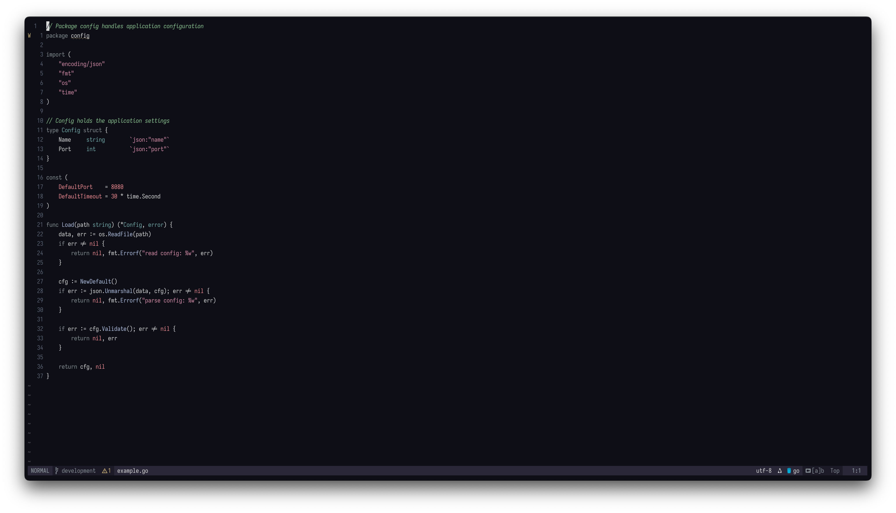
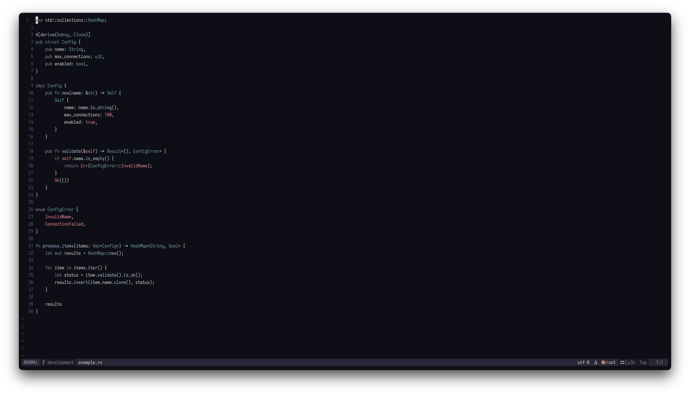
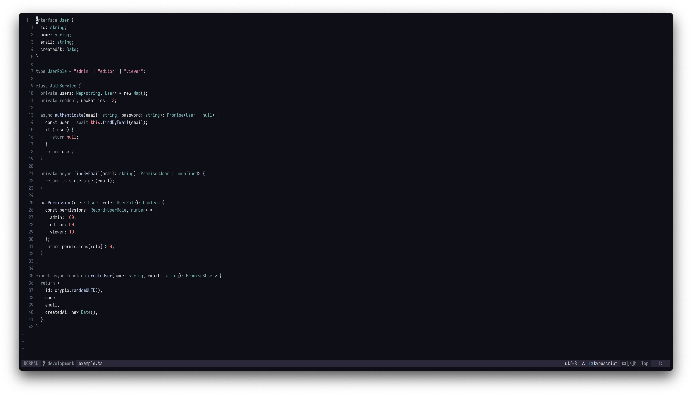
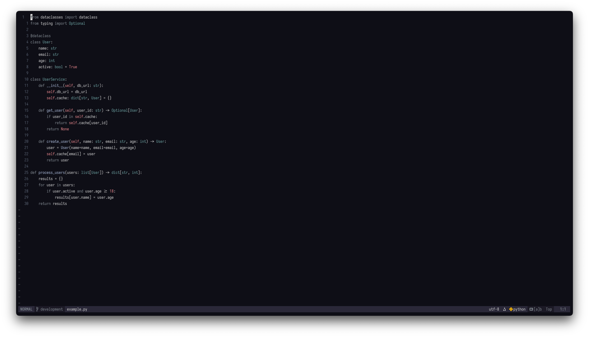
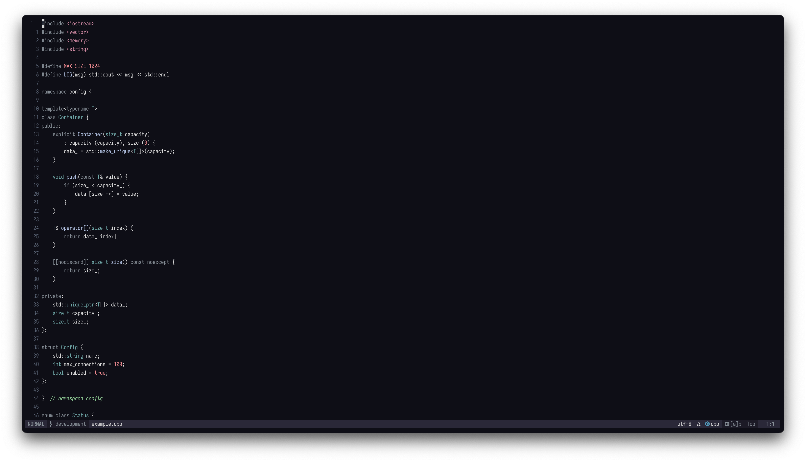
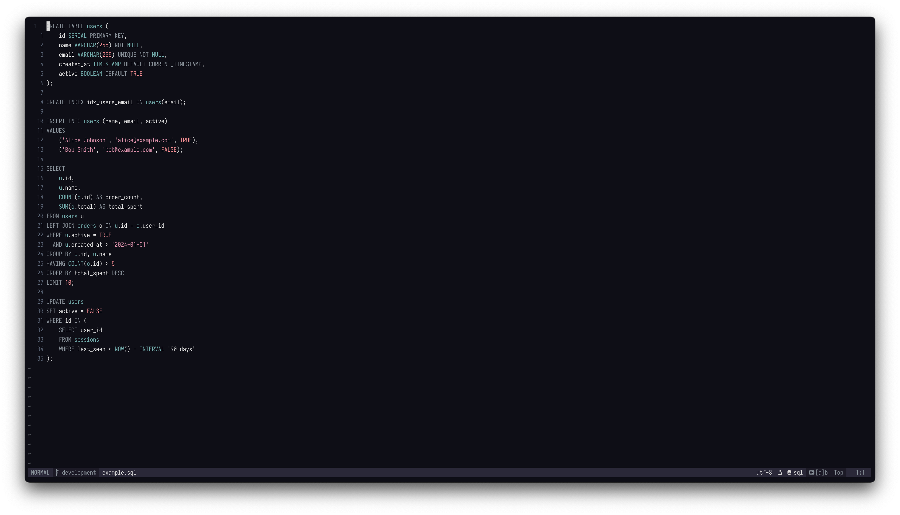

# lake-dweller.nvim

<p align="center">A minimal dark colorscheme that you can actually read at a glance.</p>

<table>
  <tr>
    <td align="center"><br><sub>Go</sub></td>
    <td align="center"><br><sub>Rust</sub></td>
  </tr>
  <tr>
    <td align="center"><br><sub>TypeScript</sub></td>
    <td align="center"><br><sub>Python</sub></td>
  </tr>
  <tr>
    <td align="center"><br><sub>C++</sub></td>
    <td align="center"><br><sub>SQL</sub></td>
  </tr>
</table>

## Requirements

- Neovim >= 0.8.0
- `termguicolors` enabled
- [nvim-treesitter](https://github.com/nvim-treesitter/nvim-treesitter) (recommended for full syntax highlighting)

## Installation

### [lazy.nvim](https://github.com/folke/lazy.nvim)

```lua
{
    "yonatan-perel/lake-dweller.nvim",
    lazy = false,
    priority = 1000,
    config = function()
        require("lake-dweller").setup({
            -- your options here
        })
        vim.cmd.colorscheme("lake-dweller")
    end,
}
```

## Configuration

```lua
require("lake-dweller").setup({
    transparent = false,       -- enable transparent background
    italics = true,            -- enable italic text
    float_background = false,  -- distinct background for floating windows
})
```

## Extras

Additional theme files for other applications are in the `extras/` directory:

- **Wezterm**: `extras/wezterm/lake-dweller.toml`

### Lualine

```lua
require("lualine").setup({
    options = {
        theme = require("lualine.themes.lake-dweller"),
    },
})
```

## Color Palette

| Color | Hex | Usage |
|-------|-----|-------|
|  Light Grey | `#d8d8d8` | Base text |
|  Rosy Pink | `#d58ca6` | Strings |
|  Soft Green | `#8ac490` | Comments |
|  Muted Slate | `#858d95` | Keywords |
|  Bright Red | `#ef8a90` | Constants, errors |
|  Pale Blue | `#b0c0e0` | Functions |
|  Muted Cyan | `#70a8a8` | Types |
|  Dark Navy | `#0e0e16` | Background |

## Supported Plugins

- [nvim-treesitter](https://github.com/nvim-treesitter/nvim-treesitter)
- [lualine.nvim](https://github.com/nvim-lualine/lualine.nvim)
- [nvim-cmp](https://github.com/hrsh7th/nvim-cmp)
- [Telescope](https://github.com/nvim-telescope/telescope.nvim)
- [fzf-lua](https://github.com/ibhagwan/fzf-lua)
- [Oil.nvim](https://github.com/stevearc/oil.nvim)
- [Trouble.nvim](https://github.com/folke/trouble.nvim)
- [which-key.nvim](https://github.com/folke/which-key.nvim)
- [Snacks.nvim](https://github.com/folke/snacks.nvim)
- [nvim-notify](https://github.com/rcarriga/nvim-notify)
- [gitsigns.nvim](https://github.com/lewis6991/gitsigns.nvim)
- [noice.nvim](https://github.com/folke/noice.nvim)

## Philosophy

This theme makes some opinionated decisions based on the following principles:

### You don't need a color for *everything*

Only use distinct colors for specific, common elements—so you can tell at a glance what you're looking at:
1. Functions
2. Types
3. Keywords
4. Constant values—numbers, booleans, strings, nulls, etc.
5. Comments

### Keywords don't need your attention

Keywords are the most repetitive part of code and therefore the easiest to read quickly—you don't really need them to stand out.

### Comments are important

You should not neglect your comments. They should pop out immediately, while being easy to distinguish from actual code.

## Inspiration

- [kanagawa.nvim](https://github.com/rebelot/kanagawa.nvim)
- [rose-pine](https://github.com/rose-pine/neovim)
- [alabaster.nvim](https://github.com/p00f/alabaster.nvim)

## License

MIT
