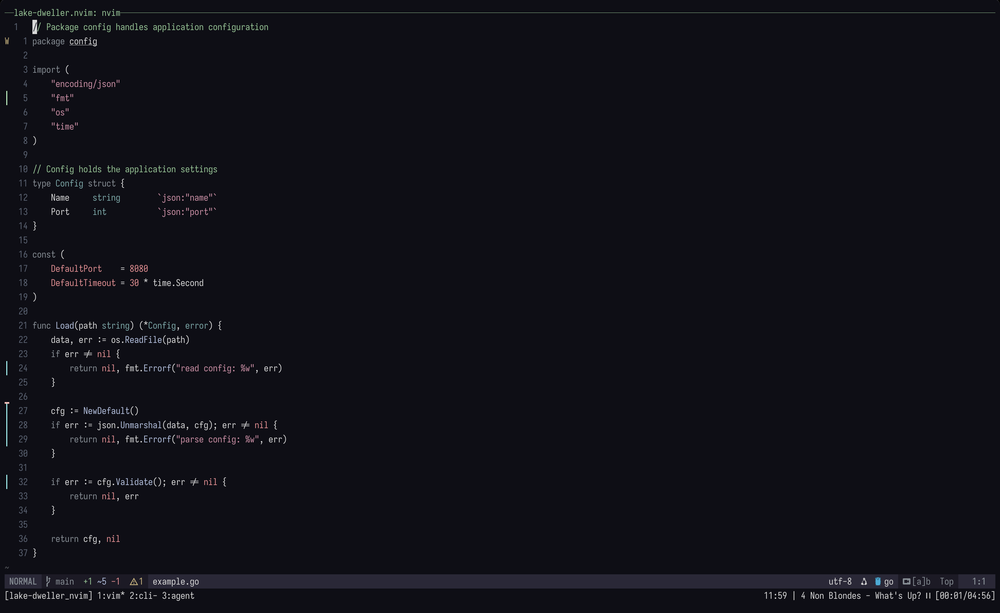

# lake-dweller.nvim

A minimal, soft dark colorscheme for Neovim with muted tones and subtle contrast.



## Requirements

- Neovim >= 0.8.0
- `termguicolors` enabled

## Installation

### [lazy.nvim](https://github.com/folke/lazy.nvim)

```lua
{
    "yonatan-perel/lake-dweller.nvim",
    lazy = false,
    priority = 1000,
    config = function()
        require("lake-dweller").setup({
            -- your options here
        })
        vim.cmd.colorscheme("lake-dweller")
    end,
}
```

## Configuration

```lua
require("lake-dweller").setup({
    transparent = false,      -- enable transparent background
    italic_comments = true,   -- use italics for comments
})
```

## Extras

Additional theme files for other applications are in the `extras/` directory:

- **Wezterm**: `extras/wezterm/lake-dweller.toml`

### Lualine

```lua
require("lualine").setup({
    options = {
        theme = require("lualine.themes.lake-dweller"),
    },
})
```

## Color Palette

| Color | Hex | Usage |
|-------|-----|-------|
| Light Grey | `#d8d8d8` | Base text |
| Rosy Pink | `#d58ca6` | Strings |
| Soft Green | `#8ac490` | Comments |
| Muted Slate | `#858d95` | Keywords |
| Bright Red | `#ef8a90` | Constants, errors |
| Pale Blue | `#b0c0e0` | Functions |
| Muted Cyan | `#70a8a8` | Types |
| Dark Navy | `#0e0e16` | Background |

## Supported Plugins

- [nvim-cmp](https://github.com/hrsh7th/nvim-cmp)
- [Telescope](https://github.com/nvim-telescope/telescope.nvim)
- [fzf-lua](https://github.com/ibhagwan/fzf-lua)
- [Oil.nvim](https://github.com/stevearc/oil.nvim)
- [Trouble.nvim](https://github.com/folke/trouble.nvim)
- [which-key.nvim](https://github.com/folke/which-key.nvim)
- [Snacks.nvim](https://github.com/folke/snacks.nvim)
- [nvim-notify](https://github.com/rcarriga/nvim-notify)

## Philosophy

This theme makes some opinionated decisions based on the following principles:

### You don't need a color for *everything*

Only use distinct colors for specific, common elements—so you can tell at a glance what you're looking at:
1. Functions
2. Types
3. Keywords
4. Constant values—numbers, booleans, strings, nulls, etc.
5. Comments

### Keywords don't need your attention

Keywords are the most repetitive part of code and therefore the easiest to read quickly—you don't really need them to stand out.

### Comments are important

You should not neglect your comments. They should pop out immediately, while being easy to distinguish from actual code.

## License

MIT
